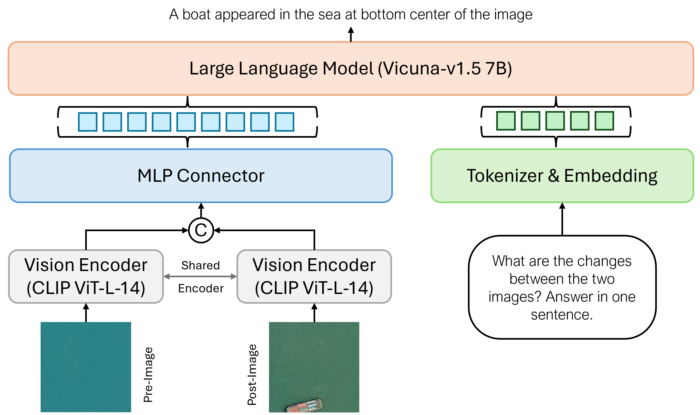
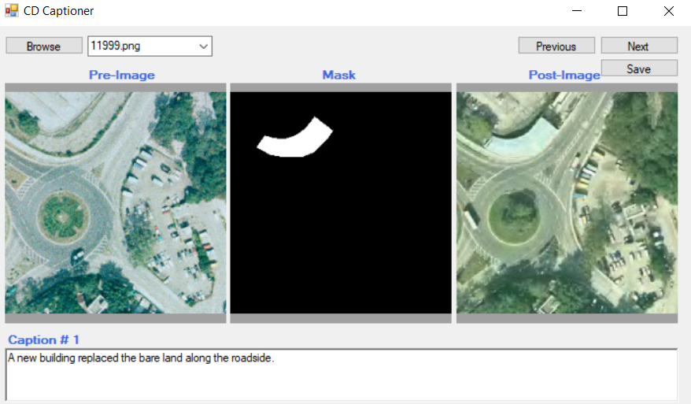

# CDChat: A Large Multimodal Model for Remote Sensing Change Description

[[Arxiv]](https://arxiv.org/abs/2409.16261)

Code and dataset files will be available soon.


### Overview
CDChat is a conversational assistant for RS change description task. We annotate the SYSU-CD dataset to obtain the change text and image pairs for instruction tuning of CDChat. We create change text and image pairs from the two large scale change detection datasets including [SYSU-CD](https://github.com/liumency/SYSU-CD) and [LEVIR-CD](https://github.com/Chen-Yang-Liu/LEVIR-CC-Dataset).



**Annotation Tool**

A custom annotation tool was utilized to annotate the SYSY-CD dataset as shown below:




### Installation
- **Clone this repository and navigate to cdchat folder**
```
git clone https://github.com/techmn/cdchat.git
cd cdchat
```
- **Install Package**
```
conda create -n cdchat python=3.10 -y
conda activate cdchat
pip install --upgrade pip  # enable PEP 660 support
pip install -e .
```
- **Install additional packages for training cases**
```
pip install ninja
pip install flash-attn --no-build-isolation
```

### Train
**Pretrain** 

We use the pretrained projector from LLaVA-v1.5 similar to [GeoChat](https://github.com/mbzuai-oryx/GeoChat).

`--mm_projector_type mlp2x_gelu:` the two-layer MLP vision-language connector

`--vision_tower openai/clip-vit-large-patch14-336:` CLIP ViT-L/14 336px


**Instruction Tuning** 

- Download the cdchat_instruct_file and the image pairs. Place the image pairs folders and cdchat_instruct_file in the same folder. 
- Update the `--data_path` and `--image_folder` in the file `finetune_lora.sh`
- Start training !!!!

**Note** Our Codebase is inspired from [GeoChat](https://github.com/mbzuai-oryx/GeoChat). Please refer to it for detailed instructions on installation and training.

**Model Weights**
will be available soon !!!!

### Evaluation
We evaluate the CDChat on the test sets of LEVIR-CD and SYSU-CD datasets. Below is the command to evaluate the CDChat on the dataset:

```
python cdchat/eval/batch_cdchat_vqa.py \
       --model-path /path/to/model \
       --question-file path/to/json/file \
       --answer-file path/to/output/jsonl/file \
       --image_folder path/to/image/folder/
```

### Citation

```
@misc{cdchat_2024,
      title={CDChat: A Large Multimodal Model for Remote Sensing Change Description}, 
      author={Mubashir Noman and Noor Ahsan and Muzammal Naseer and Hisham Cholakkal and Rao Muhammad Anwer and Salman Khan and Fahad Shahbaz Khan},
      year={2024},
      eprint={2409.16261},
      archivePrefix={arXiv},
      primaryClass={cs.CV},
      url={https://arxiv.org/abs/2409.16261}, 
}
```
### Acknowledgements
Our codebase is inspired from the [GeoChat](https://github.com/mbzuai-oryx/GeoChat) repository. We thank them for releasing their valuable codebase.
